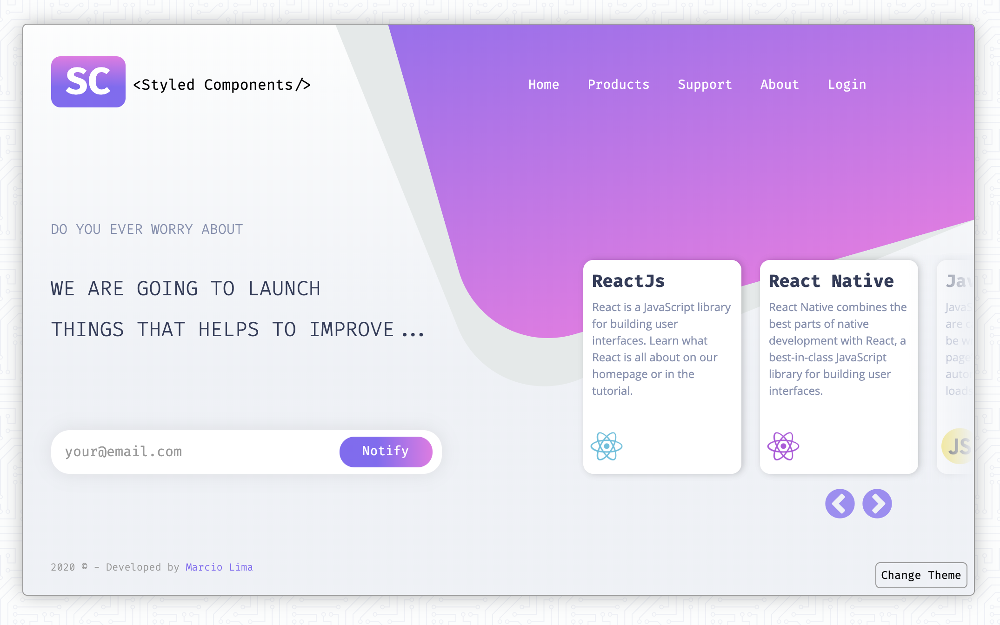
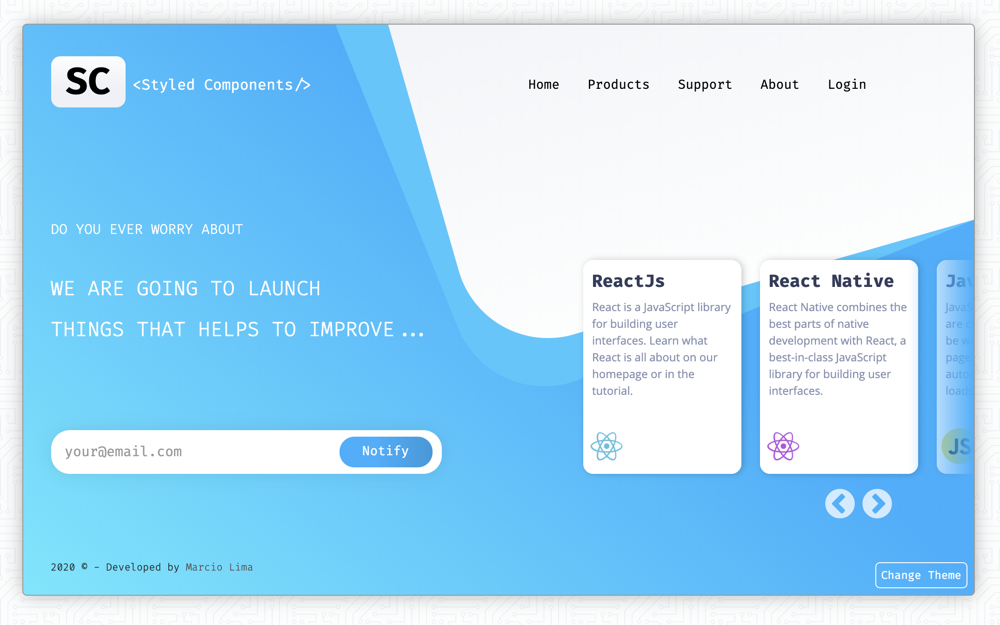
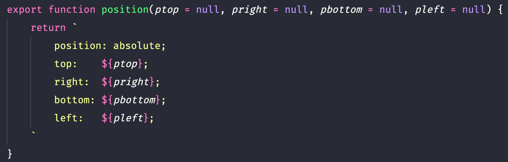
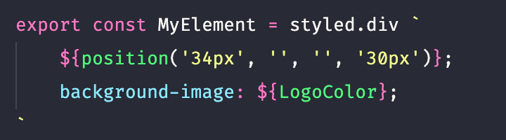

## What's behind it?

This small "landing page" project is to show a bit what we can achieve with Styled Components, I have been reluctant to use for a few reasons and then I decided to give it a try and see If I can overcame problems that I thought I could have while implementing Styled Components.

The final outcome I think it is valid, once we can keep the styles well organized, avoiding class names clashes.

One of my mains concerns was related to sass @mixins, something that in my opinion makes a lot of difference on my daily basis development, I have a tool box of mixins that I use in pretty much every single project that helps me a lot. Fortunately I could find a temporary solution that works with Styled Components as well.

I still need to explore much more about the full potential of Styled Components, but so far I'm super happy to what I could achieve with it.

## Landing Page - Purple Theme

## Landing Page - Blue Theme

---

## How I overcame the mixin problem?

Here is one example, I want to create a mixin to position an element absolutely in the page, avoiding typing every time for example: **position: absolute, top: 100px, left: 100px;** etc.

I created a function called position where I passed 4 parameters: "top, right, bottom and left" and position: absolute is taken by default.

Passing an empty parameter my css it will no render that particular value, so I don't have do worried about extras properties dentro do css.

and then I simply call the function in any element only passing the paramenters related to the positions that I want it.

---

## Components used in this Project:

- "react-slick": [link to the project](https://github.com/akiran/react-slick)
- "styled-components": [link to the project](https://github.com/styled-components/styled-components)

---

This project was bootstrapped with [Create React App](https://github.com/facebook/create-react-app).

## Available Scripts

In the project directory, you can run:

### `yarn start`

Runs the app in the development mode. 
Open [http://localhost:3000](http://localhost:3000) to view it in the browser.
